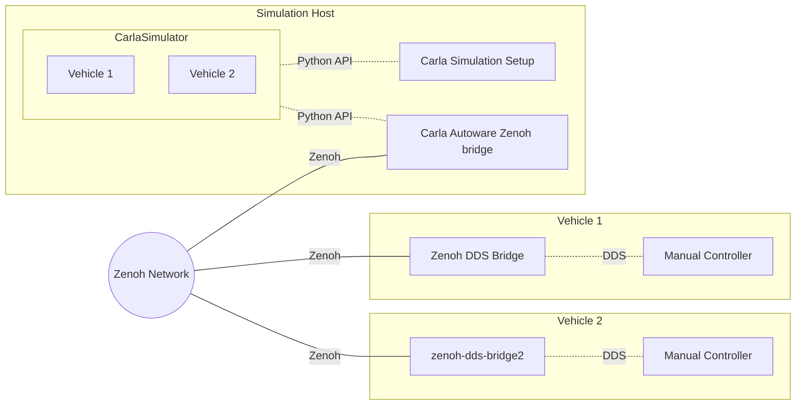

# Carla-Autoware-Zenoh Example

The repository provides a vehicle tele-operation example using Zenoh,
the next generation middleware for IoTs. The demo runs two hosts, one
running the CARLA simulator, and the other running the controller
pad. The. controller pad will be able to control the car inside the
CARLA. Two hosts are connected through the Zenoh network.

## Architecture




## Prepare the Environment

Prepare two machines with the following configuration. The default
operating system is Ubuntu 20.04. It's fine to use your favorite OS as
long as it's able to run the Docker.

**Simulation host**

- Ubuntu 20.04
- Graphics card NVIDIA 1080 or better.
- CARLA 0.9.13 ([download](https://github.com/carla-simulator/carla/releases/tag/0.9.13))
- Docker 20 or newer ([ubuntu setup](https://docs.docker.com/engine/install/ubuntu/))


**Controlling host**

- Ubuntu 20.04
- Docker 20 or newer ([ubuntu setup](https://docs.docker.com/engine/install/ubuntu/))


It's recommended to place these two hosts inside a local network, so
that they discover each other by Zenoh's default behavior. If they are
connected through the Internet, it's recommended to run the [Zenoh
router](https://zenoh.io/docs/getting-started/quick-test/) on the
third host.


## Run the Demo

This tutorial provides two ways to run the demo, one using
docker-compose, and the other running docker containers manually. Both
methods are described in the following article. For newcomers, it's
recommended to use docker-compose.


## Method 1: Using docker-compose

### Host 1: Run Carla Simulator

Run the Carla simulator.

```sh
./CarlaUE4.sh
```

Run the Carla/Autoware bridge and simulation configuration. Just let
it run forever.

```sh
cd simulation-host
docker compose up -d
```


When you decide to turn off the bridge,

```sh
cd simulation-host
docker compose down
```

### Host 2: Controller

Launch the controller and Zenoh/DDS bridge.

```sh
cd control-host
docker compose up -d
```

Attach to the controller shell. Press `?` in the shell to learn the
usage.

```sh
docker attach control-host-autoware_manual_control-1
```

## Method 2: Launch Containers Manually

### Host 1: Run Carla Simulator

Run the Carla simulator.

```sh
./CarlaUE4.sh
```

Run the agent program that configures the simulation.

```sh
docker run -it \
    --network host \
    -e DISPLAY=$DISPLAY \
    -v /tmp/.X11-unix:/tmp/.X11-unix \
    jerry73204/carla-agent:latest \
    --rolename 'v1'
```

Run the Carla/Autoware bridge.

```sh
docker run -it --network host jerry73204/carla-autoware-bridge:latest
```

### Host 2: Controller


Run the manual controller.

```sh
docker run -it \
    --network host \
    jerry73204/autoware_manual_control:latest
```

Run the Zenoh/DDS bridge.

```sh
docker run -it \
    --network host \
    jerry73204/zenoh-bridge-dds:latest \
    -s 'v1'
```
